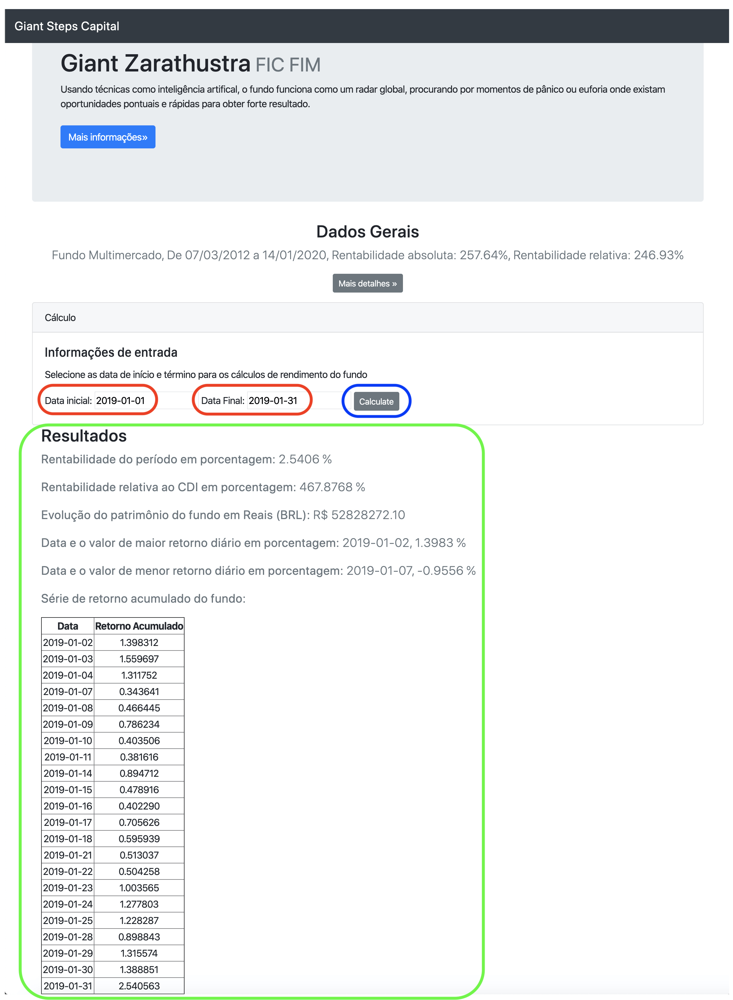

# Desafio Gian Steps

Esse projeto faz parte do desafio proposto para vaga de tecnologia.

## Primeiros Passos

As instruções abaixo fornecem suporte para funcionamento local da aplicação

### Pré-requitos

Para funcionamento é necessário instalação do docker, mais instruções podem ser encontradas no [link](https://docs.docker.com/install/) 

### Instalação

#### Método 1:

No primeiro método é utilizado a docker pull, a imagem está disponivel dentro do docker hub: fernandofsilva/giant-steps

```
docker pull fernandofsilva/giant-steps:latest
```

#### Método 2:

O segundo método é fazendo um clone do repositório e fazendo uma build da imagem com o comando abaixo:

```
docker build -t fernandofsilva/giant-steps . 
```


## Testando

Para acessar a aplicação do flask, é necessário executar o run e fazer um expose da porta para acesso externo, utilizando o comando abaixo:

```
docker run -p 5000:5000 fernandofsilva/giant-steps
```

Após isso a aplicação em flask pode ser acessada utilizando o navegador (o código foi feito utilizando como base o navegador chrome, demais navegadores não estão garantidos o pleno funcionamento)

No navegador acesse o caminho: http://127.0.0.1:5000/


## Interface

A imagem abaixo contém a interface da página, os campos em vermelho são as 
informações de entrada (é obrigatório inserir ambas as datas), depois é 
necessário clicar no botão destacado em azul para executar o código, os 
resultados são apresentados abaixo na parte destacada em verde.



## Built With

* [flask](https://flask.palletsprojects.com/en/1.1.x/) - Framework web
* [python](https://www.python.org) - script language
* [pandas](https://pandas.pydata.org) - data handling framework

## Authors

* **Fernando Silva** - *Primeira Revisão* - [desafio-tech](https://github.com/fernandofsilva/desafio-tech)

## Licença

This project is licensed under the MIT License - see the [LICENSE.md](LICENSE.md) file for details
